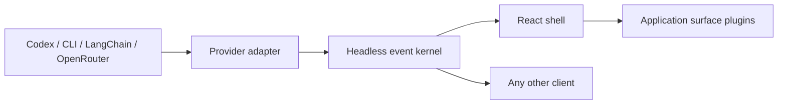

# Simplia Agent Chat

[](https://github.com/gruia-app/simplia-agent-chat/actions/workflows/ci.yml)
[](LICENSE)

Provider-neutral building blocks for agentic chat interfaces. The runtime keeps conversation state, provider events, approvals and application-owned UI surfaces separate so one interaction model can serve coding tools, content workflows, analytics, billing and other products.

The project is framework-light by design:

- `simplia-agent-chat/core` — protocol, deterministic reducer, SSE decoder, capability negotiation, surfaces and provider adapters.
- `simplia-agent-chat/react` — accessible React shell, composer, timeline, pending interactions and trusted surface registry.
- `simplia-agent-chat/adapters/acv2` — optional ACV2 durable-event adapter and provider capability profiles.

## Why

Most chat components assume that every answer is Markdown. Agent applications also need tools, plans, approvals, questions, tables, charts, media, previews and domain actions. Simplia Agent Chat models those as typed events and versioned surfaces without teaching the shared kernel how each application works.



## Install

```bash
pnpm add "simplia-agent-chat@github:gruia-app/simplia-agent-chat#<reviewed-commit-sha>"
```

Pin a reviewed commit SHA or signed release tag; do not consume a floating branch. No npm account, registry scope or publish credential is required. Applications using the React subpath must also install React and React DOM.

Reviewed commits include the compiled ESM and type declarations. Installation does not run build lifecycle scripts, so consumers may keep `ignore-scripts=true`. Node 20 or newer is required; CommonJS-only consumers need an ESM bridge.

## Minimal React usage

```tsx
import { createInitialChatState } from "simplia-agent-chat/core/state";
import { AgentChatShell, ReactSurfaceRegistry } from "simplia-agent-chat/react";
import "simplia-agent-chat/react/styles.css";

const registry = new ReactSurfaceRegistry();
const state = createInitialChatState();

export function Chat() {
  return (
    <AgentChatShell
      state={state}
      threadId="thread-1"
      title="Assistant"
      surfaceRegistry={registry}
      composerAriaLabel="Message the assistant"
      onSubmit={async (message) => console.log(message)}
      onResolveInteraction={async (interaction, resolution) =>
        console.log(interaction.id, resolution)
      }
    />
  );
}
```

The application owns transport, authentication, persistence, policy enforcement and domain mutations. The UI only emits decisions and surface actions; the server must validate them again.

## Design principles

- Provider capability and permission grants are different facts.
- Approvals and user questions are first-class interactions, not transcript strings.
- Event replay is deterministic and detects gaps, duplicates and stale revisions.
- Unknown providers, items and surfaces fail safely without breaking the thread.
- Domain surfaces are registered by the consuming application.
- Chat-completion APIs never pretend to have filesystem, terminal or approval capabilities.

See [Architecture](docs/ARCHITECTURE.md), [Integration guide](docs/INTEGRATION.md), [Surface plugins](docs/SURFACES.md) and [security policy](SECURITY.md).

## Interactive lab

```bash
pnpm install
pnpm --dir examples/react-lab dev
```

The lab demonstrates approvals, questions and custom surfaces for execution, content and analytics. It uses local fixtures and performs no external actions.

## Status

The project is pre-1.0. The current contract is tested with Codex App Server events, ACV2 durable events, LangChain stream modes and OpenAI-compatible/OpenRouter streams. API changes may occur before `1.0.0` and will be documented in the changelog.

## Contributing

Contributions are welcome. Read [CONTRIBUTING.md](CONTRIBUTING.md) before opening a pull request.

See the [roadmap](ROADMAP.md) for the remaining pre-1.0 work.

## License

Apache-2.0.
